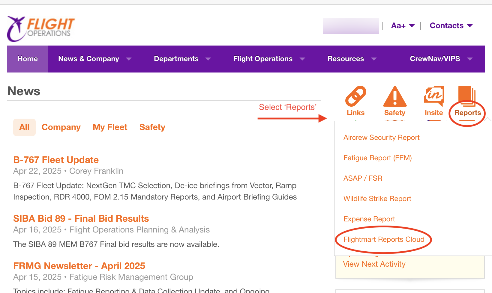
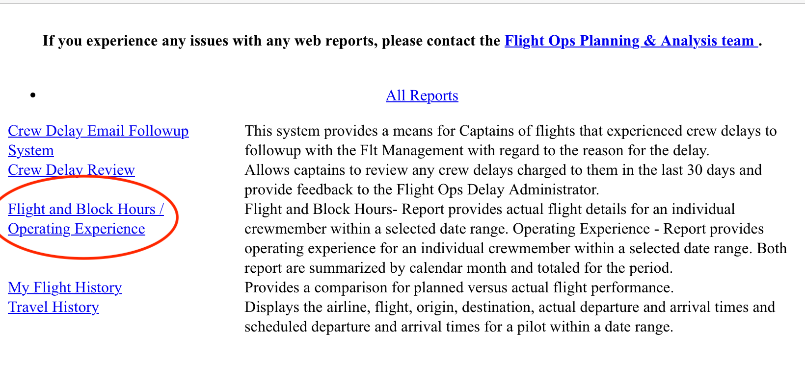
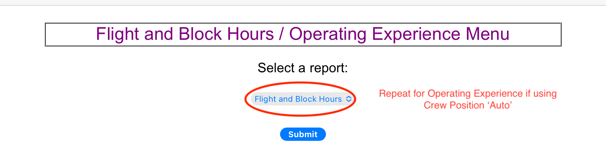
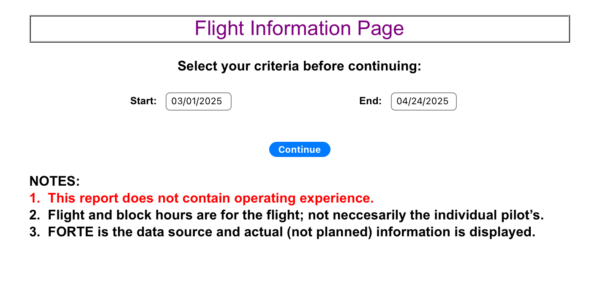
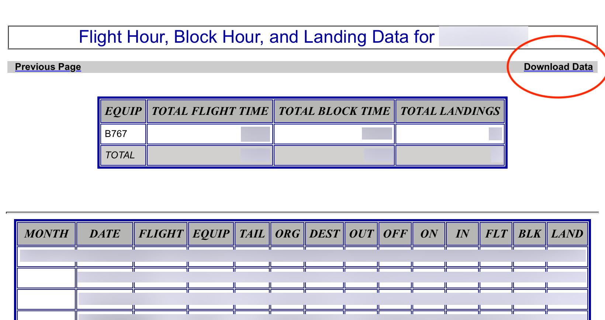
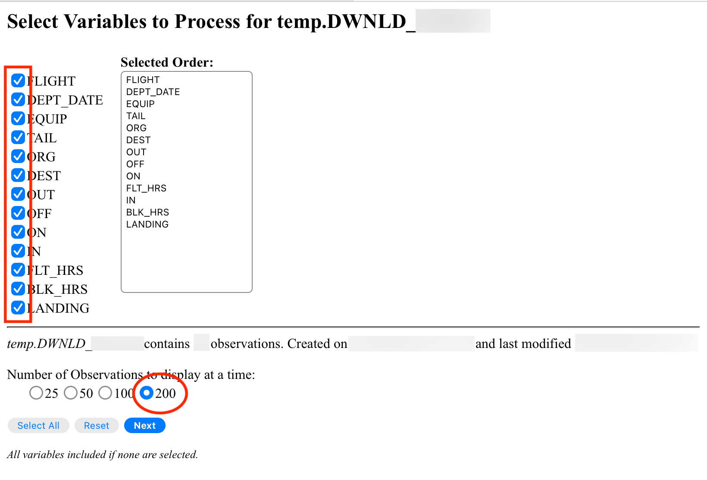
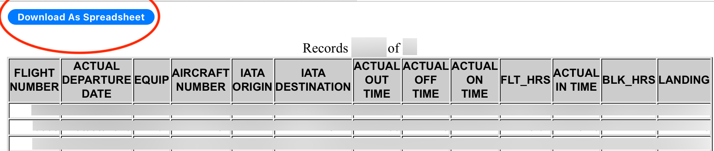
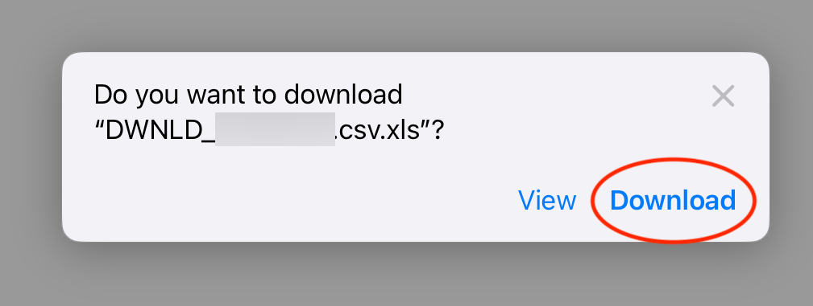
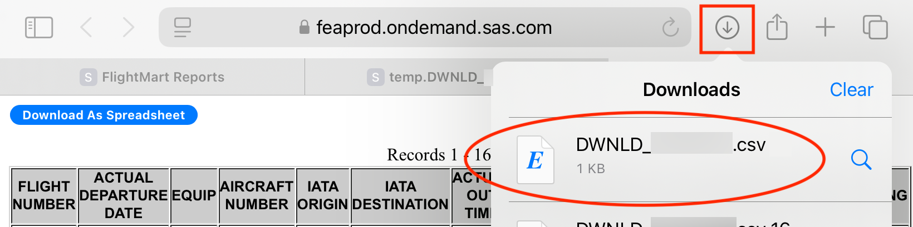
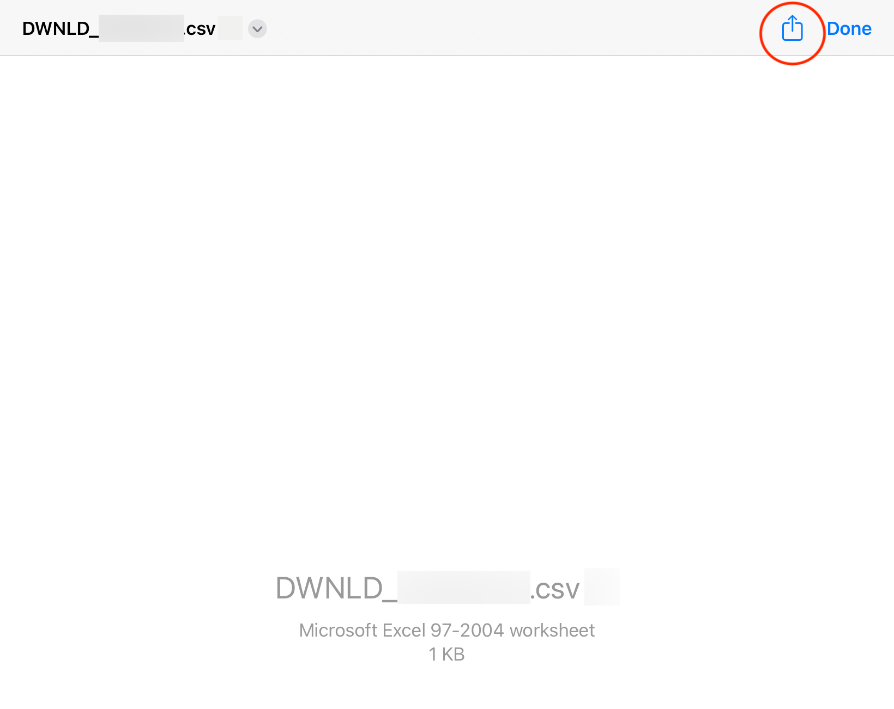

# Flightmart Flight Hours and Operating Experience Download

## Overview
This guide shows you how to download flight hours and Operating Experience data from Flightmart via PFC for use with the Logbook Formatter.

## Instructions

### Step 1: Login to PFC
- Login to PFC on a device with firewall access (e.g. iPad)
- Select **Reports** on the right side of the screen

### Step 2: Access Flight Data
- Select **Flight and Block Hours / Operating Experience** on the left side of the screen

### Step 3: Choose Report Type
- Select **Flight and Block Hours** from the dropdown menu

### Step 4: Select Date Range
- Pick a range of dates 
- **Note:** Choose a span that will yield no more than the Flightmart display limit of 200 flights

### Step 5: Download Data
- Select **Download Data** from the upper-right corner of the screen

### Step 6: Configure Export Options
- Select all of the columns on the left side of the screen
- Set the **Number of Observations to Display** to **200**

### Step 7: Download as Spreadsheet
- Select **Download as Spreadsheet** in the top-left corner of the screen

### Step 8: Confirm Download
- Select **Download** from the modal dialog

### Step 9: Access Downloads
- Select **Downloads** from the toolbar at the top of the screen (down arrow)
- Select the downloaded file

### Step 10: Share File
- Select the **Share icon** at the top of the screen
- Share to another device using your preferred method

## Next Steps
After downloading your flight data, you can process it using the Logbook Formatter:
1. Run the web app: `python app.py`
2. Open http://127.0.0.1:5000 in your browser
3. Upload the downloaded CSV file
4. Select your crew position
5. Download your FAA-formatted logbook